# Greetinglib

A simple Android library for generating personalized greeting messages, built with modern Android development practices using Kotlin, Jetpack Compose, and Clean Architecture.

## Table of Contents

- [Features](#features)
- [Project Structure](#project-structure)
- [Architecture Diagrams](#architecture-diagrams)
- [Quick Start](#quick-start)
- [Usage](#usage)
- [API Reference](#api-reference)
- [Development](#development)
- [Technical Stack](#technical-stack)
- [Contributing](#contributing)
- [License](#license)

## Features

- 🎯 **Simple API**: Easy-to-use greeting functionality
- 🏗️ **Clean Architecture**: Organized with domain, data, and presentation layers
- 💉 **Dependency Injection**: Powered by Hilt for clean and testable code
- 🎨 **Jetpack Compose**: Modern declarative UI with Material 3 components
- ✅ **Well-tested**: Comprehensive unit and instrumentation tests
- 📱 **Android Library**: Reusable AAR package for integration into any Android project

## Project Structure

```
greetinglib/
├── greetinglib/           # Main library module
│   └── src/main/java/br/com/renanalencar/greetinglib/
│       ├── data/          # Data layer (repository implementations)
│       ├── domain/        # Domain layer (models, repositories, use cases)
│       └── presentation/  # Presentation layer (Compose UI components)
└── app/                   # Demo application
    └── src/main/java/br/com/renanalencar/greetinglib/demo/
```

## Architecture Diagrams

### Clean Architecture Overview


### Class Diagram


### Sequence Diagram - Greeting Flow

```mermaid
sequenceDiagram
    participant U as User
    participant MA as MainActivity
    participant MVM as MainViewModel
    participant GC as GreetingComponent
    participant GUC as GetGreetingUseCase
    participant GRI as GreetingRepositoryImpl
    participant G as Greeting
    
    U->>MA: App Launch
    MA->>MVM: Create ViewModel
    MVM->>GRI: Create Repository
    MVM->>GUC: Create UseCase(repository)
    MA->>GC: setContent { GreetingComponent() }
    GC->>GUC: execute("Mundo")
    GUC->>GRI: getGreeting("Mundo")
    GRI->>G: Create Greeting("Olá, Mundo!")
    G-->>GRI: return Greeting
    GRI-->>GUC: return Greeting
    GUC-->>GC: return Greeting
    GC->>GC: Display Text(greeting.message)
    GC-->>U: Show "Olá, Mundo!"
```



### State Diagram - App Lifecycle


### Component Interaction Flow


## Quick Start

### Prerequisites

- Android Studio Ladybug | 2024.3.1+
- Android SDK 35+
- Kotlin 2.0.21+

### Installation

1. Clone the repository:
```bash
git clone https://github.com/renanalencar/greetinglib.git
cd greetinglib
```

2. Build the project:
```bash
./gradlew build
```

3. Run the demo app:
```bash
./gradlew :app:installDebug
```

### Usage

#### Basic Implementation with Hilt

```kotlin
// 1. Set up your Application class
@HiltAndroidApp
class MyApplication : Application()

// 2. Create your Activity with Hilt
@AndroidEntryPoint
class MainActivity : ComponentActivity() {
    override fun onCreate(savedInstanceState: Bundle?) {
        super.onCreate(savedInstanceState)
        setContent {
            MainContent()
        }
    }
}

// 3. Use Hilt ViewModel in your Composable
@Composable
fun MainContent() {
    val viewModel: MainViewModel = hiltViewModel()
    
    GreetingComponent(
        name = "World",
        useCase = viewModel.useCase
    )
}

// 4. Create ViewModel with Hilt injection
@HiltViewModel
class MainViewModel @Inject constructor(
    val useCase: GetGreetingUseCase
) : ViewModel()
```

#### Legacy Implementation (Without Hilt)

```kotlin
// In your ViewModel or dependency injection setup
private val repository = GreetingRepositoryImpl()
private val useCase = GetGreetingUseCase(repository)

// In your Composable
@Composable
fun MyScreen() {
    GreetingComponent(
        name = "World",
        useCase = useCase
    )
}
```

#### Integration in Your Project

1. Build the library:
```bash
./gradlew :greetinglib:assembleRelease
```

2. Include the generated AAR in your project's `libs` folder

3. Add to your app's `build.gradle.kts`:
```kotlin
plugins {
    // ... other plugins
    id("com.google.dagger.hilt.android")
    id("kotlin-kapt")
}

dependencies {
    implementation(files("libs/greetinglib-release.aar"))
    implementation("androidx.compose.material3:material3:1.3.1")
    implementation("androidx.compose.ui:ui:1.7.6")
    
    // Hilt dependencies
    implementation("com.google.dagger:hilt-android:2.50")
    kapt("com.google.dagger:hilt-android-compiler:2.50")
    implementation("androidx.hilt:hilt-navigation-compose:1.2.0")
}
```

4. Update your `Application` class:
```kotlin
@HiltAndroidApp
class MyApplication : Application()
```

5. Update your `AndroidManifest.xml`:
```xml
<application
    android:name=".MyApplication"
    ... >
```

## API Reference

### Core Components

#### `Greeting`
```kotlin
data class Greeting(val message: String)
```

#### `GreetingRepository`
```kotlin
interface GreetingRepository {
    fun getGreeting(name: String): Greeting
}
```

#### `GreetingRepositoryImpl`
```kotlin
class GreetingRepositoryImpl : GreetingRepository {
    override fun getGreeting(name: String): Greeting
}
```

#### `GetGreetingUseCase`
```kotlin
class GetGreetingUseCase(private val repository: GreetingRepository) {
    fun execute(name: String): Greeting
}
```

#### `GreetingComponent`
```kotlin
@Composable
fun GreetingComponent(name: String, useCase: GetGreetingUseCase)
```

### Hilt Modules

#### `GreetingModule` (Library)
```kotlin
@Module
@InstallIn(SingletonComponent::class)
object GreetingModule {
    @Provides
    @Singleton
    fun provideGreetingRepository(): GreetingRepository
}
```

#### Example App Module
```kotlin
@Module
@InstallIn(SingletonComponent::class)
object AppModule {
    @Provides
    @Singleton
    fun provideGetGreetingUseCase(repository: GreetingRepository): GetGreetingUseCase
}
```

#### Example ViewModel
```kotlin
@HiltViewModel
class MainViewModel @Inject constructor(
    val useCase: GetGreetingUseCase
) : ViewModel()
```

## Development

### Build Commands

```bash
# Build entire project
./gradlew build

# Build library only
./gradlew :greetinglib:assembleDebug

# Run unit tests
./gradlew test

# Run specific test class
./gradlew test --tests "ExampleUnitTest"

# Run instrumented tests
./gradlew connectedAndroidTest

# Clean build
./gradlew clean
```

### Testing

The project includes comprehensive testing:

- **Unit Tests**: Business logic validation
- **Instrumentation Tests**: Android-specific functionality
- **Compose Tests**: UI component testing

Run all tests:
```bash
./gradlew check
```

### Code Style

This project follows Clean Architecture principles:

- **Domain Layer**: Business logic, models, and repository interfaces
- **Data Layer**: Repository implementations and data sources  
- **Presentation Layer**: UI components and view models

The architecture diagrams above illustrate how these layers interact and maintain separation of concerns.

For detailed coding guidelines, see [AGENTS.md](AGENTS.md).

### Architecture Documentation

The diagrams in this README provide visual documentation of:

- **Clean Architecture Overview**: Shows the dependency flow between layers
- **Class Diagram**: Details the relationships between all classes and interfaces
- **Sequence Diagram**: Illustrates the complete greeting generation flow from user interaction to UI display
- **State Diagram**: Maps the application lifecycle and state transitions
- **Component Interaction Flow**: Simplified view of data flow through the system

These diagrams are rendered using [Mermaid](https://mermaid.js.org/) syntax and can be viewed directly in GitHub or any Mermaid-compatible viewer.

## Technical Stack

| Component | Technology |
|-----------|------------|
| Language | Kotlin 2.0.21 |
| UI Framework | Jetpack Compose |
| Design System | Material 3 |
| Architecture | Clean Architecture |
| Dependency Injection | Hilt 2.50 |
| Build System | Gradle (Kotlin DSL) |
| Testing | JUnit 4, Espresso |
| Min SDK | 35 |
| Target SDK | 36 |

## Contributing

1. Fork the repository
2. Create a feature branch (`git checkout -b feature/amazing-feature`)
3. Commit your changes (`git commit -m 'Add amazing feature'`)
4. Push to the branch (`git push origin feature/amazing-feature`)
5. Open a Pull Request

Please ensure your code follows the project's coding guidelines and includes appropriate tests.

## License

This project is licensed under the MIT License - see the [LICENSE](LICENSE) file for details.

## Changelog

### [1.1.0] - 2024-11-24

#### Added
- Hilt dependency injection support
- Full-screen layout with Scaffold and Material 3 design
- Preview functions for better development experience
- Hilt modules for clean dependency management

#### Changed
- MainActivity now uses `@AndroidEntryPoint` with Hilt
- MainViewModel updated to `@HiltViewModel` with constructor injection
- MainContent composable now occupies the whole screen
- Updated documentation with Hilt integration examples

#### Technical
- Added Hilt 2.50 dependencies
- Added Hilt Navigation Compose 1.2.0
- Fixed unresolved references in MainActivity
- Enhanced project architecture with dependency injection

### [1.0.0] - 2024-11-24

#### Added
- Initial release of greetinglib
- Basic greeting functionality with Portuguese messages
- Clean Architecture implementation
- Jetpack Compose UI components
- Unit and instrumentation tests
- Demo application

## Support

For questions or issues, please [open an issue](https://github.com/renanalencar/greetinglib/issues) on GitHub.

---

**Made with ❤️ using modern Android development practices**